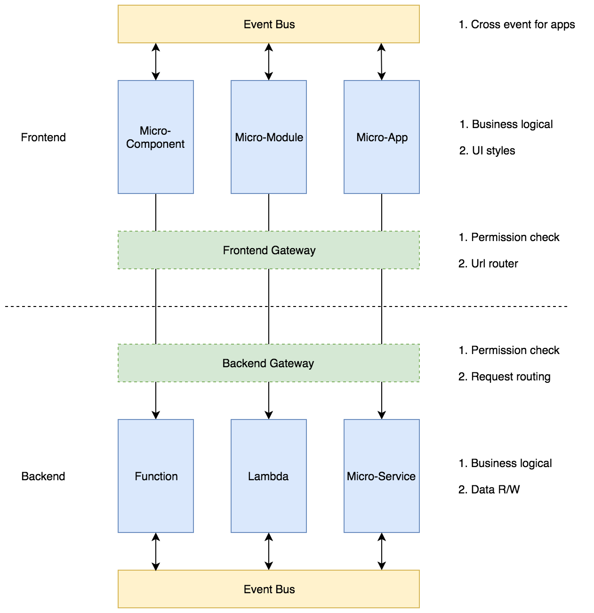

# mixspa-core
mixspa-core is a base library for micro-frontend.

## Current Status:

[](https://npmjs.org/package/@mixspa/core)
[](https://npmjs.org/package/@mixspa/core)
[](https://circleci.com/gh/mixspa/mixspa-core)

[](https://nodei.co/npm/@mixspa/core/)

## What's the purpose for this library

The aim of this library what to be.



The following targets:
* A component or module can be an app to be load dynamically.
* A component or module can choice a different framework or library by itself.
* A component or module together with the backend service should have the whole and independent business.


## What the api for this library?

### 1. Define an app

According the following to define a app. The `id` & `render` must be provided.

```js
import Mixspa from '@mixspa/core';

Mixspa.define({
  tag: 'app-demo', /* This name will be used for tag name */
  init: function(element) {
    /* will be call when custom element has been created */
  },
  render: function(element) {
    let attrName = element.getAttribute('data-name'); //
    /* will be call after custom element has been rendered */
  },
  unmount: function(element) {
    /* will be call when custom element has been removed */
  },
  update: function(element) {
    /* will be call when attribute has been changed */
  }
});
```

The Mixspa will create a custom element for one app.
About more details & the apis for `element`, please reference here:
[CustomElement](https://developer.mozilla.org/en-US/docs/Web/API/CustomElementRegistry)

### 2. Register one app

```js
import Mixspa from '@mixspa/core'

Mixspa.register({
  id: 'app-id',
  tag: 'app-demo',
  assets: ['https://www.app-demo.com/app.js', 'https://www.app-demo.com/app.css']
});
```

### 3. Get one app and load

```js
import Mixspa from '@mixspa/core'

Mixspa.getApp('app-id').load([Element]).then(app => {
  let el = document.createElement(app.tag);
  el.attributeOne = 'attribute one';
  document.getElementById('app-container').appendChild(el);
});
```

### 4. Event in Mixspa

```js
import Mixspa from '@mixspa/core'
/*
Mixspa.on('[module]:[action]', listener);  // bind event
*/
Mixspa.on('test:update', (message) => {
  console.log(message);
});

/*
Mixspa.off('[module]:[action]', listener);  // unbind event
*/
Mixspa.off('test:update', listener);

/*
Mixspa.emit('[module]:[action]', message);  // emit event
*/
Mixspa.emit('test:update', 'Hello Test');
```

### 5. Link in Mixspa

```js
import Mixspa from '@mixspa/core'
/*
Mixspa.onLink(handler);  // bind link change event
*/
Mixspa.onLink((url) => {
  console.log(url);
});

/*
Mixspa.offLink(handler);  // unbind link change event
*/
Mixspa.offLink(handler);

/*
Mixspa.emitLink(url);  // emit link change event
*/
Mixspa.emitLink('http://test.url');
```

## License

mixspa-app is released under the [MIT license](https://github.com/mixspa/mixspa-core/blob/master/LICENSE).
